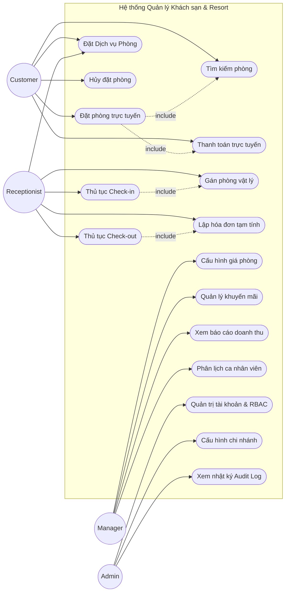
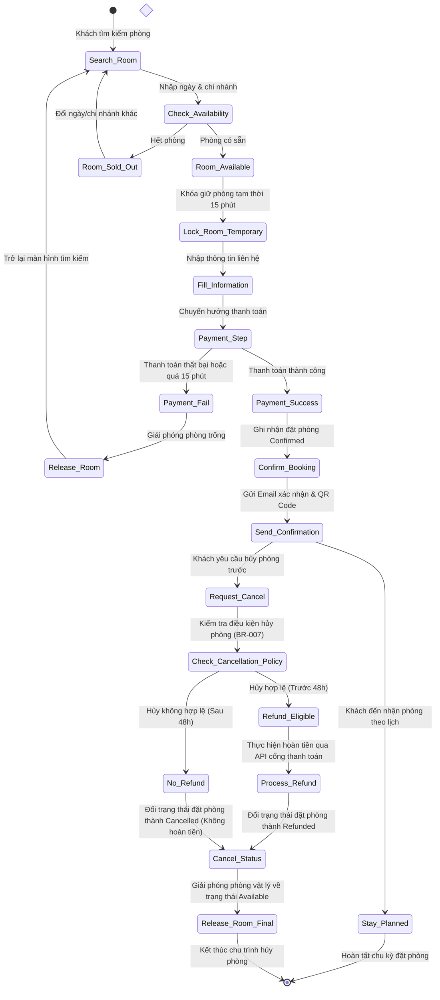
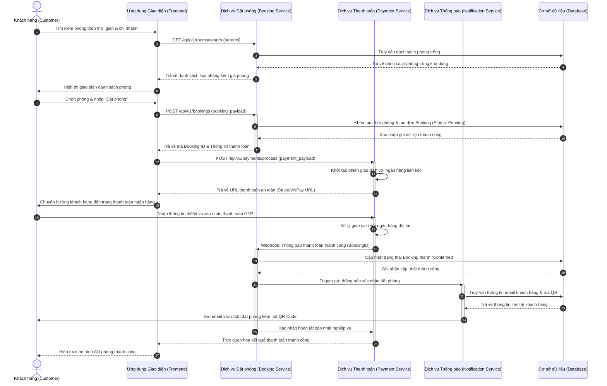
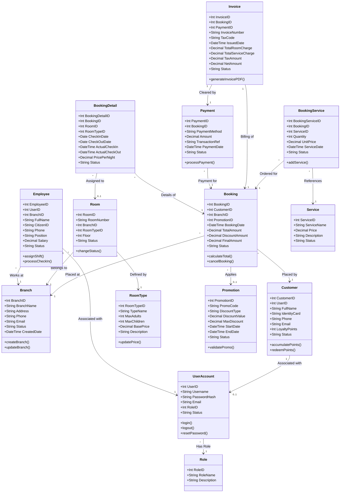

# TÀI LIỆU ĐẶC TẢ YÊU CẦU PHẦN MỀM (SRS)
## HỆ THỐNG QUẢN LÝ KHÁCH SẠN & RESORT DOANH NGHIỆP (HOTEL MANAGEMENT & RESORT ENTERPRISE SYSTEM)

---

### MỤC LỤC
1. [BỐI CẢNH DỰ ÁN (PROJECT CONTEXT)](#1-bối-cảnh-dự-án-project-context)
2. [TÁC NHÂN HỆ THỐNG (ACTORS)](#2-tác-nhân-hệ-thống-actors)
3. [CÁC PHÂN HỆ CHỨC NĂNG (SYSTEM MODULES)](#3-các-phân-hệ-chức-năng-system-modules)
4. [KỊCH BẢN NGƯỜI DÙNG (USER STORIES)](#4-kịch-bản-người-dùng-user-stories)
5. [YÊU CẦU CHỨC NĂNG (FUNCTIONAL REQUIREMENTS)](#5-yêu-cầu-chức-năng-functional-requirements)
6. [YÊU CẦU PHI CHỨC NĂNG (NON-FUNCTIONAL REQUIREMENTS)](#6-yêu-cầu-phi-chức-năng-non-functional-requirements)
7. [QUY TẮC NGHIỆP VỤ (BUSINESS RULES)](#7-quy-tắc-nghiệp-vụ-business-rules)
8. [THIẾT KẾ CƠ SỞ DỮ LIỆU (DATABASE DESIGN)](#8-thiết-kế-cơ-sở-dữ-liệu-database-design)
9. [TỪ ĐIỂN DỮ LIỆU (DATA DICTIONARY)](#9-từ-điển-dữ-liệu-data-dictionary)
10. [SƠ ĐỒ USE CASE (USE CASE DIAGRAM)](#10-sơ-đồ-use-case-use-case-diagram)
11. [SƠ ĐỒ HOẠT ĐỘNG (ACTIVITY DIAGRAM - BOOKING ROOM)](#11-sơ-đồ-hoạt-động-activity-diagram---booking-room)
12. [SƠ ĐỒ TRÌNH TỰ (SEQUENCE DIAGRAM - BOOKING & PAYMENT)](#12-sơ-đồ-trình-tự-sequence-diagram---booking--payment)
13. [SƠ ĐỒ LỚP (CLASS DIAGRAM)](#13-sơ-đồ-lớp-class-diagram)
14. [SƠ ĐỒ QUAN HỆ THỰC THỂ (ERD)](#14-sơ-đồ-quan-hệ-thực-thể-erd)
15. [CÁC TRƯỜNG HỢP NGOẠI LỆ (EXCEPTION CASES)](#15-các-trường-hược-ngoại-lệ-exception-cases)
16. [KỊCH BẢN KIỂM THỬ (TEST SCENARIOS)](#16-kịch-bản-kiểm-thử-test-scenarios)
17. [ĐỊNH HƯỚNG PHÁT TRIỂN TƯƠNG LAI (FUTURE ENHANCEMENTS)](#17-định-hướng-phát-triển-tương-lai-future-enhancements)

---

## 1. BỐI CẢNH DỰ ÁN (PROJECT CONTEXT)

### 1.1. Business Background (Bối cảnh nghiệp vụ)
Trong kỷ nguyên số hóa và phát triển mạnh mẽ của ngành du lịch, các chuỗi khách sạn và resort quy mô lớn đối mặt với thách thức quản lý vận hành tập trung tại nhiều chi nhánh khác nhau. Các phương thức quản lý truyền thống hoặc hệ thống đơn lẻ không còn đáp ứng được nhu cầu tối ưu hóa công suất phòng, quản lý doanh thu thời gian thực, đồng bộ hóa thông tin khách hàng, và mang lại trải nghiệm cá nhân hóa. Dự án **Hotel Management & Resort System** được phát triển nhằm cung cấp một nền tảng quản trị tổng thể (Enterprise Resource Planning - ERP chuyên biệt cho ngành lưu trú) giúp doanh nghiệp vận hành trơn tru từ khâu đặt phòng, quản lý dịch vụ phòng, thanh toán cho đến quản trị nhân sự và báo cáo tài chính toàn chuỗi.

### 1.2. Business Objectives (Mục tiêu kinh doanh)
*   **Tối ưu hiệu suất sử dụng phòng (Occupancy Rate):** Tăng ít nhất 15% hiệu suất phòng thông qua hệ thống phân phối phòng thông minh và cập nhật thời gian thực (Real-time).
*   **Trải nghiệm khách hàng vượt trội:** Giảm thời gian làm thủ tục Check-in/Check-out xuống dưới 3 phút mỗi lượt.
*   **Quản lý tập trung đa chi nhánh (Multi-branch):** Giúp Ban giám đốc kiểm soát dòng tiền, doanh thu, nhân sự và báo cáo tổng hợp toàn chuỗi khách sạn từ một màn hình Dashboard duy nhất.
*   **Tối đa hóa doanh thu dịch vụ phụ trợ (Upselling):** Tích hợp phân hệ Room Service trực tuyến giúp khách hàng dễ dàng đặt đồ ăn, spa, tour từ thiết bị cá nhân.

### 1.3. Project Scope (Phạm vi dự án)
Hệ thống là một nền tảng Web-based chạy trên nền tảng Cloud (SaaS) kết hợp Web App dành cho thiết bị di động để khách hàng và nhân viên tương tác nhanh chóng.

#### 1.3.1. In Scope (Nằm trong phạm vi)
*   Quản trị hệ thống và người dùng (phân quyền chi tiết RBAC).
*   Quản lý danh mục phòng, loại phòng, chi nhánh, tiện ích và trạng thái phòng thời gian thực.
*   Quy trình đặt phòng (Booking) trực tuyến qua Web Portal và trực tiếp tại quầy (Walk-in).
*   Quy trình Check-in/Check-out chuyên nghiệp, tích hợp quản lý thẻ khóa từ.
*   Tích hợp thanh toán đa phương thức (Tiền mặt, Thẻ ngân hàng, Ví điện tử).
*   Quản lý chương trình khuyến mãi, Voucher giảm giá theo mùa vụ hoặc nhóm khách hàng thân thiết.
*   Quản lý dịch vụ phòng (Room Service), ẩm thực (F&B), giặt là, spa.
*   Quản lý thông tin và ca làm việc của nhân viên tại từng chi nhánh.
*   Báo cáo thống kê trực quan (Doanh thu, tỉ lệ lấp đầy phòng, doanh thu dịch vụ, lịch sử thao tác).

#### 1.3.2. Out Of Scope (Nằm ngoài phạm vi)
*   Hệ thống quản lý chuỗi cung ứng nguyên vật liệu kho sâu (Inventory/Warehouse ERP chi tiết cho bếp).
*   Hệ thống tự xây dựng cổng thanh toán riêng (Sẽ tích hợp thông qua các cổng thanh toán trung gian như Stripe, VNPay).
*   Giải pháp phần cứng khóa từ vật lý (Chỉ cung cấp API tích hợp SDK của nhà sản xuất khóa từ).

### 1.4. Stakeholders (Các bên liên quan)
*   **Khách hàng (Customer):** Người sử dụng dịch vụ lưu trú.
*   **Nhân viên lễ tân (Receptionist):** Người trực tiếp thao tác check-in, check-out, và đặt phòng trực tiếp tại quầy.
*   **Quản lý khách sạn/chi nhánh (Manager):** Giám sát hoạt động hàng ngày, duyệt khuyến mãi, xuất báo cáo doanh thu.
*   **Quản trị viên hệ thống (Admin):** Quản lý cơ sở dữ liệu cấu hình hệ thống, phân quyền tài khoản, giám sát bảo mật.
*   **Nhà đầu tư/Ban giám đốc (Board of Directors):** Theo dõi hiệu quả kinh doanh vĩ mô toàn chuỗi.

### 1.5. Assumptions & Constraints (Giả định và Hạn chế)
*   **Giả định (Assumptions):**
    *   Hạ tầng Internet tại các chi nhánh luôn hoạt động ổn định ổn định.
    *   Nhân viên vận hành được đào tạo cơ bản về công nghệ thông tin.
    *   Khách hàng sử dụng smartphone có kết nối internet để thao tác đặt dịch vụ.
*   **Hạn chế (Constraints):**
    *   Phải tuân thủ nghiêm ngặt Luật Bảo vệ dữ liệu cá nhân (GDPR / Nghị định 13/2023/NĐ-CP của Việt Nam).
    *   Hệ thống phải tương thích hoàn toàn trên cả Desktop và thiết bị di động (Responsive Web Design).

### 1.6. Glossary (Thuật ngữ chuyên ngành)
*   **SRS:** Software Requirement Specification (Đặc tả yêu cầu phần mềm).
*   **RBAC:** Role-Based Access Control (Kiểm soát truy cập dựa trên vai trò).
*   **OTA:** Online Travel Agent (Đại lý du lịch trực tuyến như Agoda, Booking.com).
*   **PMS:** Property Management System (Hệ thống quản lý khách sạn).
*   **Walk-in:** Khách vãng lai đến đặt phòng trực tiếp tại quầy không qua đặt trước.
*   **Folio:** Hóa đơn tạm tính chi tiết của khách hàng trong suốt thời gian lưu trú.

---

## 2. TÁC NHÂN HỆ THỐNG (ACTORS)

| Tác nhân (Actor) | Vai trò (Role) | Quyền hạn (Permissions) | Trách nhiệm (Responsibilities) | Mục tiêu sử dụng (Goals) |
| :--- | :--- | :--- | :--- | :--- |
| **Customer** (Khách hàng) | Người sử dụng dịch vụ đầu cuối. | Truy cập công cộng và tài khoản cá nhân. Đăng ký, đặt phòng, đặt dịch vụ room service, thanh toán hóa đơn cá nhân. | Cung cấp thông tin cá nhân chính xác, thanh toán đúng hạn các dịch vụ sử dụng. | Tìm kiếm, đặt phòng nhanh chóng, quản lý lịch sử đặt phòng, thanh toán an toàn, yêu cầu dịch vụ tiện lợi. |
| **Receptionist** (Nhân viên lễ tân) | Nhân sự vận hành trực tiếp tại tiền sảnh. | Xem sơ đồ phòng, đặt phòng hộ khách hàng (Walk-in/Phone), thực hiện thủ tục Check-in/Check-out, gán phòng vật lý, thu tiền trực tiếp, quản lý dịch vụ phòng. | Đón tiếp khách hàng, đảm bảo thông tin lưu trú chính xác, giải quyết các yêu cầu cơ bản của khách tại quầy. | Thực hiện nghiệp vụ Check-in/Check-out nhanh gọn, chính xác, không để khách đợi lâu, cập nhật trạng thái phòng tức thời. |
| **Manager** (Quản lý chi nhánh) | Người điều hành hoạt động của chi nhánh/chuỗi. | Xem toàn bộ báo cáo doanh thu, phê duyệt khuyến mãi, quản lý phân công ca làm việc nhân viên, điều chỉnh giá phòng linh hoạt, phê duyệt hoàn tiền. | Đảm bảo hiệu quả vận hành chi nhánh đạt KPI, tối ưu hóa công suất phòng, quản lý nhân sự. | Giám sát doanh thu thực tế, theo dõi hiệu suất nhân viên, tối ưu hóa doanh thu thông qua chiến lược giá và khuyến mãi. |
| **Admin** (Quản trị viên) | Kỹ thuật viên quản trị hệ thống IT. | Toàn quyền cấu hình hệ thống (Full Access), quản lý tài khoản người dùng, cấu hình tham số hệ thống, backup/restore, xem nhật ký hệ thống (Audit Logs). | Bảo trì hệ thống hoạt động 24/7, cập nhật bảo mật, hỗ trợ kỹ thuật cho các actor khác. | Đảm bảo an toàn thông tin, bảo mật dữ liệu, tính sẵn sàng cao của hệ thống và giải quyết nhanh các sự cố kỹ thuật. |

---

## 3. CÁC PHÂN HỆ CHỨC NĂNG (SYSTEM MODULES)

### 3.1. Phân hệ 1: User Management (Quản lý người dùng)
*   **Mục tiêu:** Quản trị tập trung và bảo mật thông tin tài khoản của khách hàng, nhân viên và quản trị viên.
*   **Chức năng:** Đăng ký, đăng nhập (hỗ trợ SSO/Social Login), xác thực 2 lớp (2FA), quản lý hồ sơ cá nhân, phân quyền truy cập theo vai trò (RBAC), phục hồi mật khẩu.
*   **Input:** Thông tin đăng ký (Email, Mật khẩu, Số điện thoại), mã OTP xác thực, thông tin phân quyền.
*   **Output:** Tài khoản hoạt động, JWT Token xác thực, nhật ký đăng nhập.

### 3.2. Phân hệ 2: Room Management (Quản lý phòng & Loại phòng)
*   **Mục tiêu:** Quản lý cơ sở vật chất phòng, phân loại phòng và thiết lập giá linh hoạt cho toàn hệ thống.
*   **Chức năng:** Tạo mới/Chỉnh sửa/Xóa chi nhánh (Branch), loại phòng (Room Type - Deluxe, Suite, Standard), phòng cụ thể. Cấu hình giá phòng theo mùa vụ/ngày lễ. Cập nhật trạng thái phòng (Trống, Đang ở, Cần dọn dẹp, Bảo trì).
*   **Input:** Tên loại phòng, mô tả, giá cơ bản, hình ảnh phòng, số phòng, trạng thái phòng vật lý.
*   **Output:** Danh sách phòng cập nhật trên giao diện đặt phòng trực tuyến và giao diện lễ tân.

### 3.3. Phân hệ 3: Booking Management (Quản lý đặt phòng)
*   **Mục tiêu:** Xử lý và quản lý toàn bộ vòng đời của giao dịch đặt phòng từ trực tuyến đến trực tiếp.
*   **Chức năng:** Tìm kiếm phòng trống theo thời gian và chi nhánh, giữ phòng tạm thời, tạo đơn đặt phòng, thay đổi thông tin đặt phòng, hủy đặt phòng, tự động gửi email/SMS xác nhận.
*   **Input:** Ngày check-in, ngày check-out, số lượng khách, loại phòng yêu cầu, thông tin khách hàng.
*   **Output:** Mã đặt phòng (Booking ID) duy nhất, trạng thái Booking (Pending, Confirmed, Cancelled).

### 3.4. Phân hệ 4: Check-in / Check-out (Thủ tục nhận/trả phòng)
*   **Mục tiêu:** Số hóa quy trình đón tiếp và tiễn khách hàng tại quầy lễ tân.
*   **Chức năng:** Tìm kiếm nhanh thông tin đặt phòng, ghi nhận giấy tờ tùy thân (Quét Passport/CCCD), gán số phòng cụ thể, cấp phát mã khóa từ, lập hóa đơn tạm tính (Folio), thực hiện check-out và thu phí phát sinh.
*   **Input:** Mã Booking ID, bản quét CCCD/Passport, danh sách chi phí phát sinh, trạng thái bàn giao phòng.
*   **Output:** Trạng thái phòng chuyển sang "Occupied" (khi check-in) hoặc "Dirty" (khi check-out), hóa đơn thanh toán cuối cùng.

### 3.5. Phân hệ 5: Payment Management (Quản lý thanh toán)
*   **Mục tiêu:** Xử lý các giao dịch tài chính an toàn, minh bạch và đa kênh.
*   **Chức năng:** Thanh toán tiền đặt cọc trực tuyến, thanh toán hóa đơn check-out trực tiếp, tích hợp cổng thanh toán (Stripe, VNPay), xử lý giao dịch hoàn tiền (Refund), ghi nhận phương thức thanh toán.
*   **Input:** Số tiền thanh toán, thông tin thẻ/ví điện tử, mã giao dịch.
*   **Output:** Trạng thái giao dịch (Success, Failed, Pending), mã tham chiếu ngân hàng (Transaction Reference).

### 3.6. Phân hệ 6: Invoice Management (Quản lý hóa đơn)
*   **Mục tiêu:** Tạo và lưu trữ hóa đơn pháp lý phục vụ cho việc đối soát tài chính và báo cáo thuế.
*   **Chức năng:** Xuất hóa đơn VAT tự động dựa trên hóa đơn tạm tính (Folio) gồm tiền phòng và tiền dịch vụ, gửi hóa đơn điện tử (e-Invoice) qua Email của khách hàng, kết xuất dữ liệu hóa đơn phục vụ kế toán.
*   **Input:** Chi tiết các khoản chi phí từ Folio, thông tin xuất hóa đơn của doanh nghiệp/khách hàng.
*   **Output:** File hóa đơn định dạng PDF, mã hóa đơn điện tử được cơ quan thuế chấp thuận.

### 3.7. Phân hệ 7: Promotion Management (Quản lý chương trình khuyến mãi)
*   **Mục tiêu:** Thu hút khách hàng và tối ưu hóa doanh thu vào mùa thấp điểm.
*   **Chức năng:** Tạo chiến dịch khuyến mãi (Giảm giá theo %, Giảm tiền trực tiếp, Tặng kèm dịch vụ), quản lý mã Coupon/Voucher, cấu hình điều kiện áp dụng (Ví dụ: Đặt tối thiểu 2 đêm).
*   **Input:** Mã khuyến mãi, phần trăm giảm giá, ngày bắt đầu/kết thúc, giới hạn số lần sử dụng.
*   **Output:** Giá trị giảm trừ được áp dụng vào hóa đơn đặt phòng khi thỏa mãn điều kiện.

### 3.8. Phân hệ 8: Room Service Management (Quản lý dịch vụ phòng)
*   **Mục tiêu:** Cung cấp trải nghiệm đặt đồ ăn, thức uống, spa, giặt là nhanh chóng cho khách lưu trú.
*   **Chức năng:** Hiển thị menu dịch vụ số trên thiết bị của khách hàng, tiếp nhận đơn đặt dịch vụ, chuyển tiếp yêu cầu đến các bộ phận tương ứng (Bếp, Spa, Buồng phòng), cập nhật trạng thái đơn dịch vụ (Đang chuẩn bị, Đã giao), tự động ghi nhận chi phí vào Folio phòng.
*   **Input:** Mã phòng, danh sách món ăn/dịch vụ chọn lọc, ghi chú đặc biệt.
*   **Output:** Yêu cầu in trực tiếp tại bếp/quầy spa, trạng thái đơn hàng hoàn thành, chi phí cộng dồn vào hóa đơn phòng.

### 3.9. Phân hệ 9: Employee Management (Quản lý nhân sự & Ca làm việc)
*   **Mục tiêu:** Quản trị lực lượng lao động tại các chi nhánh để vận hành trơn tru.
*   **Chức năng:** Quản lý thông tin nhân sự, phân lịch trực/ca làm việc cho nhân viên lễ tân, buồng phòng, bảo vệ, chấm công hàng ngày qua hệ thống, ghi nhận lịch sử xử lý công việc.
*   **Input:** Thông tin nhân viên, lịch ca làm việc mong muốn, dữ liệu chấm công đầu vào.
*   **Output:** Bảng phân ca chi tiết hàng tuần/tháng, báo cáo đi muộn/về sớm.

### 3.10. Phân hệ 10: Dashboard & Report (Báo cáo & Thống kê)
*   **Mục tiêu:** Cung cấp bức tranh tài chính và vận hành trực quan cho cấp quản lý và Ban giám đốc.
*   **Chức năng:** Trực quan hóa tỷ lệ lấp đầy phòng (Occupancy Rate), doanh thu theo ngày/tháng/năm/chi nhánh (RevPAR - Revenue Per Available Room), báo cáo thống kê dịch vụ ăn uống, biểu đồ tăng trưởng khách hàng mới, xuất dữ liệu báo cáo dạng Excel/PDF.
*   **Input:** Dữ liệu lịch sử giao dịch thanh toán, dữ liệu đặt phòng, dữ liệu chi phí vận hành.
*   **Output:** Biểu đồ tương tác thời gian thực, tệp báo cáo chi tiết phục vụ cuộc họp Ban giám đốc.

---

## 4. KỊCH BẢN NGƯỜI DÙNG (USER STORIES)

### 4.1. Phân hệ Đặt phòng (Booking Management)
*   **User Story US-01 (Customer):**
    *   **As a** Khách hàng vãng lai,
    *   **I want to** tìm kiếm phòng trống theo ngày đi, ngày đến và địa điểm chi nhánh trên website,
    *   **So that** tôi có thể lựa chọn phòng phù hợp nhất với nhu cầu và ngân sách của mình.
    *   **Acceptance Criteria:**
        1. Hệ thống hiển thị đúng danh sách loại phòng còn trống tại chi nhánh đã chọn trong khoảng thời gian yêu cầu.
        2. Hiển thị rõ ràng giá tiền phòng, hình ảnh thực tế, diện tích và các tiện ích đi kèm của loại phòng đó.
        3. Cho phép lọc phòng theo khoảng giá, loại giường và các đánh giá từ khách hàng trước.

*   **User Story US-02 (Customer):**
    *   **As a** Khách hàng đã chọn được phòng,
    *   **I want to** thực hiện đặt phòng trực tuyến và thanh toán đặt cọc qua cổng ngân hàng,
    *   **So that** tôi chắc chắn phòng đó được giữ lại cho chuyến đi của tôi.
    *   **Acceptance Criteria:**
        1. Hệ thống khóa tạm thời phòng được chọn trong vòng 15 phút để khách thực hiện giao dịch thanh toán.
        2. Tích hợp thanh toán an toàn và trả về kết quả ngay lập tức trên màn hình.
        3. Gửi email xác nhận đặt phòng kèm mã QR Code check-in ngay sau khi nhận được thông báo giao dịch thành công.

### 4.2. Phân hệ Vận hành quầy (Check-in / Check-out)
*   **User Story US-03 (Receptionist):**
    *   **As a** Nhân viên lễ tân khách sạn,
    *   **I want to** quét mã QR trên điện thoại của khách hàng để tải nhanh thông tin Booking,
    *   **So that** tôi có thể làm thủ tục Check-in nhận phòng cho khách trong thời gian ngắn nhất.
    *   **Acceptance Criteria:**
        1. Hệ thống tự động điền các thông tin của khách hàng vào biểu mẫu Check-in sau khi quét mã QR thành công.
        2. Cho phép lễ tân chụp ảnh/quét CCCD/Passport của khách và lưu trực tiếp vào hệ thống dưới dạng tệp đính kèm của hồ sơ lưu trú.
        3. Trạng thái phòng được gán tự động cập nhật từ "Trống/Sạch" sang "Đang ở (Occupied)".

### 4.3. Phân hệ Quản trị & Báo cáo (Dashboard & Report)
*   **User Story US-04 (Manager):**
    *   **As a** Quản lý chi nhánh khách sạn,
    *   **I want to** xem biểu đồ doanh thu và tỷ lệ lấp đầy phòng theo thời gian thực (Real-time Occupancy Chart),
    *   **So that** tôi có thể đưa ra quyết định điều chỉnh giá phòng hoặc tung ra các khuyến mãi kích cầu kịp thời.
    *   **Acceptance Criteria:**
        1. Màn hình Dashboard cập nhật dữ liệu tự động mỗi 5 phút một lần mà không cần tải lại trang.
        2. Biểu đồ trực quan cho thấy sự so sánh doanh thu giữa các tuần/tháng/năm liền kề.
        3. Cho phép xuất dữ liệu nguồn ra định dạng Microsoft Excel chỉ bằng 1 lượt nhấp chuột.

---

## 5. YÊU CẦU CHỨC NĂNG (FUNCTIONAL REQUIREMENTS)

### 5.1. Phân hệ Booking Management

#### FR-001: Đặt phòng trực tuyến (Online Room Booking)
*   **Description:** Cho phép khách hàng tìm kiếm và tiến hành đặt phòng trên website của hệ thống.
*   **Preconditions:** Khách hàng đã truy cập vào website của khách sạn.
*   **Main Flow:**
    1. Khách hàng nhập thông tin tìm kiếm: Chi nhánh, Ngày Check-in, Ngày Check-out, Số lượng khách.
    2. Hệ thống kiểm tra dữ liệu khả dụng của các phòng trong cơ sở dữ liệu.
    3. Hệ thống trả về danh sách các phòng còn trống kèm theo giá tiền và các tiện ích.
    4. Khách hàng lựa chọn phòng, nhập thông tin cá nhân (Họ tên, SĐT, Email).
    5. Khách hàng chọn phương thức thanh toán đặt cọc trực tuyến.
    6. Hệ thống chuyển hướng sang cổng thanh toán liên kết.
    7. Sau khi thanh toán thành công, hệ thống tạo bản ghi trong bảng `Booking` với trạng thái "Confirmed".
    8. Hệ thống gửi email xác nhận cho khách hàng kèm theo mã QR Code.
*   **Alternative Flow:**
    *   *Tại bước 2:* Nếu không còn phòng trống nào phù hợp, hệ thống hiển thị thông báo: "Không tìm thấy phòng trống theo yêu cầu của bạn, vui lòng đổi ngày hoặc chi nhánh khác" và gợi ý các ngày lân cận còn phòng.
*   **Input:** Ngày đi/đến, Số người lớn/trẻ em, Chi nhánh, Loại phòng, Thông tin khách hàng, Thông tin thanh toán.
*   **Output:** Mã đặt phòng (Booking ID) duy nhất, Trạng thái đơn đặt phòng "Confirmed", Email xác nhận.
*   **Validation Rule:**
    *   Ngày Check-in phải lớn hơn hoặc bằng ngày hiện tại.
    *   Ngày Check-out phải lớn hơn ngày Check-in ít nhất 1 ngày.
    *   Số điện thoại khách hàng phải là định dạng hợp lệ (10 chữ số tại Việt Nam).
*   **Exception Handling:**
    *   Nếu cổng thanh toán bị lỗi kết nối, hệ thống hủy phiên đặt phòng tạm thời sau 15 phút, trả phòng về trạng thái "Trống" và thông báo lỗi thanh toán đến khách hàng qua màn hình giao diện.

---

### 5.2. Phân hệ Check-in / Check-out

#### FR-002: Thực hiện thủ tục nhận phòng (Check-in Processing)
*   **Description:** Cho phép nhân viên lễ tân thực hiện thủ tục nhận phòng cho khách đã đặt trước hoặc khách vãng lai (Walk-in).
*   **Preconditions:** Nhân viên lễ tân đã đăng nhập vào hệ thống PMS thành công.
*   **Main Flow:**
    1. Lễ tân tìm kiếm đặt phòng bằng cách nhập Booking ID hoặc quét mã QR Code trên thiết bị của khách hàng.
    2. Hệ thống tải thông tin đặt phòng chi tiết lên màn hình.
    3. Lễ tân thực hiện quét giấy tờ tùy thân (CCCD/Passport) của khách hàng để lưu thông tin.
    4. Lễ tân xác nhận số phòng vật lý được phân bổ cho khách dựa trên danh sách phòng trống thuộc loại phòng đã đặt.
    5. Lễ tân nhấp chọn nút "Confirm Check-in" trên hệ thống.
    6. Hệ thống cập nhật trạng thái phòng vật lý sang "Occupied".
    7. Hệ thống kích hoạt thẻ khóa phòng thông qua phần mềm tích hợp khóa từ.
*   **Alternative Flow:**
    *   *Khách Walk-in (Chưa đặt trước):* Lễ tân chọn chức năng "Walk-in Check-in" -> Chọn phòng trống trực tiếp trên sơ đồ phòng -> Nhập thông tin khách hàng và thanh toán trực tiếp tại quầy -> Xác nhận Check-in.
*   **Input:** Mã đặt phòng, Bản chụp CCCD/Passport, Số phòng được gán.
*   **Output:** Trạng thái Booking chuyển sang "Checked-In", Trạng thái phòng chuyển sang "Occupied", thẻ từ vật lý được kích hoạt thành công.
*   **Validation Rule:**
    *   Chỉ cho phép Check-in khi trạng thái Booking hiện tại là "Confirmed".
    *   Không cho phép gán phòng vật lý đang có trạng thái là "Dirty" (Chưa dọn dẹp) hoặc "Maintenance" (Đang bảo trì).
*   **Exception Handling:**
    *   Nếu hệ thống ghi thẻ từ bị lỗi kết nối phần cứng, hiển thị cảnh báo "Lỗi kết nối bộ ghi thẻ từ. Vui lòng cấp khóa thủ công và kiểm tra thiết bị kết nối". Hệ thống vẫn ghi nhận trạng thái Check-in trên phần mềm để tránh gián đoạn quy trình của khách hàng.

---

### 5.3. Phân hệ Payment Management

#### FR-003: Xử lý hoàn tiền đặt phòng (Process Refund Booking)
*   **Description:** Cho phép Quản lý chi nhánh thực hiện hoàn trả tiền cho khách hàng khi họ thực hiện hủy đặt phòng đúng theo quy định hủy phòng.
*   **Preconditions:** Đặt phòng ở trạng thái "Cancelled", tài khoản thực hiện phải có vai trò "Manager".
*   **Main Flow:**
    1. Quản lý truy cập danh sách đặt phòng đã hủy và chọn đơn cần xử lý hoàn tiền.
    2. Hệ thống hiển thị chi tiết số tiền đã thanh toán trước đó và chính sách hủy phòng áp dụng (Ví dụ: Hoàn 100%, Hoàn 50%, Không hoàn tiền).
    3. Hệ thống tự động tính toán số tiền thực tế được hoàn lại dựa theo số giờ hủy phòng trước ngày Check-in.
    4. Quản lý xác nhận số tiền hoàn và nhấp chọn "Approve Refund".
    5. Hệ thống gửi lệnh yêu cầu hoàn tiền đến API cổng thanh toán liên kết.
    6. Cổng thanh toán xử lý hoàn tiền và trả về mã giao dịch thành công.
    7. Hệ thống cập nhật trạng thái đơn đặt phòng thành "Refunded" và tạo hóa đơn âm điện tử.
*   **Alternative Flow:**
    *   *Hoàn tiền thủ công (Cash/Bank Transfer):* Nếu cổng thanh toán không hỗ trợ hoàn tiền tự động (Quá hạn hoàn tự động của ngân hàng), quản lý chọn phương án "Manual Refund" -> Nhập thông tin tài khoản ngân hàng nhận tiền của khách -> Đính kèm minh chứng chuyển tiền -> Xác nhận hoàn thành.
*   **Input:** Mã đặt phòng (Booking ID), Lý do hoàn tiền, Phương thức hoàn tiền.
*   **Output:** Trạng thái giao dịch hoàn tiền "Refund Success", Email thông báo tiến trình hoàn tiền gửi tới khách hàng.
*   **Validation Rule:**
    *   Số tiền hoàn lại không được vượt quá số tiền khách hàng đã thanh toán thực tế.
*   **Exception Handling:**
    *   Nếu API cổng thanh toán từ chối lệnh hoàn tiền do lỗi số dư tài khoản doanh nghiệp không đủ, hệ thống chuyển trạng thái giao dịch sang "Refund Failed" và gửi thông báo khẩn cấp đến phòng Kế toán để xử lý thủ công.

---

## 6. YÊU CẦU PHI CHỨC NĂNG (NON-FUNCTIONAL REQUIREMENTS)

### 6.1. Hiệu năng (Performance)
*   **Thời gian phản hồi hệ thống (Response Time):** Thời gian phản hồi của các API nghiệp vụ thông thường (truy vấn danh sách phòng, kiểm tra giá) phải dưới 1.5 giây. Các tác vụ nặng như xuất báo cáo tổng hợp năm không được quá 5 giây.
*   **Khả năng chịu tải (Concurrency):** Hệ thống tối thiểu phải phục vụ đồng thời 5,000 người dùng truy cập website đặt phòng cùng lúc và 500 nhân viên lễ tân thao tác nghiệp vụ PMS mà không có hiện tượng trễ hoặc nghẽn mạng.

### 6.2. An toàn & Bảo mật (Security)
*   **Mã hóa dữ liệu (Data Encryption):** Toàn bộ dữ liệu truyền tải giữa máy khách và máy chủ phải được mã hóa bằng giao thức HTTPS/TLS 1.3. Thông tin nhạy cảm như Mật khẩu, Số CCCD/Passport, Số thẻ thanh toán phải được băm và mã hóa một chiều/hai chiều bằng thuật toán mã hóa mạnh (SHA-256, AES-256) trước khi lưu vào cơ sở dữ liệu.
*   **Bảo vệ khỏi các cuộc tấn công phổ biến:** Hệ thống phải có cơ chế ngăn chặn các cuộc tấn công SQL Injection, Cross-Site Scripting (XSS), Cross-Site Request Forgery (CSRF) và tấn công từ chối dịch vụ (DDoS) thông qua thiết lập tường lửa ứng dụng web (WAF).

### 6.3. Phân quyền & Xác thực (Authentication & Authorization)
*   **Xác thực (Authentication):** Sử dụng cơ chế JSON Web Token (JWT) có thời hạn ngắn (ví dụ: 1 giờ) kết hợp Refresh Token để quản lý phiên làm việc của người dùng. Tài khoản quản trị viên và quản lý bắt buộc phải cấu hình xác thực 2 lớp (2FA - Google Authenticator hoặc SMS OTP).
*   **Phân quyền (Authorization):** Triển khai phân quyền chặt chẽ theo mô hình RBAC (Role-Based Access Control). Mọi API endpoint phải kiểm tra quyền của token gửi lên trước khi trả về dữ liệu.

### 6.4. Tính sẵn sàng & Độ tin cậy (Availability & Reliability)
*   **Độ sẵn sàng (Availability):** Cam kết SLA tối thiểu 99.9% thời gian hoạt động liên tục (Uptime) trong 1 năm (tương đương thời gian ngừng hoạt động tối đa không quá 8.76 giờ/năm).
*   **Tính sẵn sàng dự phòng (Redundancy):** Triển khai hệ thống trên nền tảng Cloud đa vùng (Multi-region Active-Passive hoặc Active-Active) để tự động chuyển mạch (Failover) khi một vùng gặp sự cố vật lý.

### 6.5. Khả năng mở rộng & Bảo trì (Scalability & Maintainability)
*   **Khả năng mở rộng (Scalability):** Hệ thống được thiết kế theo kiến trúc Microservices để có thể dễ dàng mở rộng độc lập từng phân hệ khi nhu cầu sử dụng tăng cao (ví dụ: tự động tăng quy mô pod cho Booking Service vào mùa du lịch cao điểm bằng Kubernetes Auto-scaling).
*   **Khả năng bảo trì (Maintainability):** Mã nguồn phải được cấu trúc rõ ràng theo mô hình Clean Architecture, có tài liệu API đầy đủ (Swagger/OpenAPI UI) giúp các nhà phát triển dễ dàng sửa lỗi và phát triển tính năng mới.

### 6.6. Sao lưu & Phục hồi dữ liệu (Backup & Recovery)
*   **Sao lưu (Backup):** Tự động sao lưu dữ liệu (Daily Backup) vào lúc 02:00 sáng hàng ngày và lưu trữ tại cụm lưu trữ đám mây độc lập. Bản sao lưu phải được giữ ít nhất trong vòng 90 ngày.
*   **Phục hồi (Recovery):** Thời gian phục hồi mục tiêu (RTO - Recovery Time Objective) dưới 2 giờ và điểm phục hồi mục tiêu (RPO - Recovery Point Objective) tối đa là 24 giờ kể từ thời điểm xảy ra sự cố nghiêm trọng đối với trung tâm dữ liệu chính.

### 6.7. Nhật ký hoạt động & Giám sát (Logging & Monitoring)
*   **Nhật ký hoạt động (Audit Logs):** Ghi lại toàn bộ lịch sử thay đổi cấu hình, tạo/sửa/xóa dữ liệu, đăng nhập hệ thống của nhân viên và quản trị viên trong bảng `AuditLog` để phục vụ công tác thanh tra bảo mật.
*   **Giám sát (Monitoring):** Tích hợp công cụ giám sát hiệu năng hệ thống (APM - Prometheus & Grafana) để cảnh báo tức thời cho đội ngũ vận hành (SRE) qua Telegram/Email khi CPU hoặc RAM của máy chủ vượt ngưỡng an toàn 85% kéo dài liên tục quá 5 phút.

### 6.8. Giao diện Responsive & Khả năng tiếp cận (Responsive UI & Accessibility)
*   **Responsive UI:** Giao diện người dùng dành cho khách hàng phải hiển thị tối ưu trên các kích thước màn hình từ điện thoại di động (375px), máy tính bảng (768px) đến máy tính để bàn (1920px). Giao diện lễ tân được tối ưu cho các thao tác nhanh bằng bàn phím trên Desktop.
*   **Khả năng tiếp cận (Accessibility):** Tuân thủ tiêu chuẩn WCAG 2.1 cấp độ AA nhằm hỗ trợ những người dùng khuyết tật nhẹ (ví dụ như độ tương phản màu sắc tốt, có thẻ alt cho mọi hình ảnh, hỗ trợ trình đọc màn hình screen reader).

---

## 7. QUY TẮC NGHIỆP VỤ (BUSINESS RULES)

*   **BR-001 (Room Booking Window):** Hệ thống chỉ chấp nhận các yêu cầu đặt phòng trước tối đa 365 ngày so với ngày nhận phòng thực tế.
*   **BR-002 (Booking Deposit):** Các giao dịch đặt phòng trực tuyến có tổng trị giá trên 5,000,000 VND bắt buộc phải thanh toán đặt cọc tối thiểu 50% giá trị đặt phòng để chuyển sang trạng thái "Confirmed". Các booking dưới mức này có thể chọn thanh toán tại quầy nếu được khách sạn hỗ trợ.
*   **BR-003 (Standard Check-in Time):** Giờ nhận phòng tiêu chuẩn là từ 14:00 giờ của ngày đến dự kiến. Nhận phòng trước 14:00 giờ sẽ chịu phí phụ thu theo quy định BR-004.
*   **BR-004 (Early Check-in Fee):** Khách nhận phòng sớm từ 06:00 đến 09:00 phụ thu 50% tiền phòng 1 đêm; từ 09:00 đến 14:00 phụ thu 30% tiền phòng 1 đêm; trước 06:00 phụ thu 100% tiền phòng 1 đêm.
*   **BR-005 (Standard Check-out Time):** Giờ trả phòng tiêu chuẩn là trước 12:00 giờ trưa của ngày đi dự kiến. Trả phòng sau 12:00 trưa sẽ chịu phí phụ thu theo quy định BR-006.
*   **BR-006 (Late Check-out Fee):** Khách trả phòng trễ từ 12:00 đến 15:00 phụ thu 30% tiền phòng 1 đêm; từ 15:00 đến 18:00 phụ thu 50% tiền phòng 1 đêm; sau 18:00 phụ thu 100% tiền phòng 1 đêm.
*   **BR-007 (Cancellation Window & Penalty):** Khách hàng được quyền hủy đặt phòng miễn phí tối thiểu 48 giờ trước ngày Check-in. Hủy trong vòng 24 - 48 giờ trước ngày Check-in sẽ bị phạt 50% số tiền đặt cọc. Hủy dưới 24 giờ trước ngày Check-in sẽ bị mất 100% số tiền đặt cọc.
*   **BR-008 (Room Maximum Capacity):** Mỗi phòng có giới hạn sức chứa tối đa về số lượng người lớn và trẻ em theo cấu hình của loại phòng (Ví dụ: Phòng Standard tối đa 2 người lớn và 1 trẻ em). Vượt quá số lượng này bắt buộc phải yêu cầu đặt thêm phòng phụ hoặc chịu phí phụ thu thêm người (Extra Guest Fee).
*   **BR-009 (Promotion Stacking Limit):** Mỗi đơn đặt phòng chỉ được phép áp dụng tối đa một chương trình khuyến mãi (Promotion) hoặc một mã giảm giá (Coupon Code). Không được phép cộng dồn nhiều chương trình khuyến mãi trừ khi chiến dịch đó có đánh dấu đặc biệt cho phép cộng dồn.
*   **BR-010 (Role-Based Pricing Access):** Nhân viên lễ tân không có quyền thay đổi đơn giá phòng cơ bản của hệ thống. Chỉ có quản lý chi nhánh hoặc bộ phận kinh doanh cấp cao được quyền cấu hình lại bảng giá phòng.
*   **BR-011 (Booking Pending Expiration):** Một đơn đặt phòng trực tuyến có trạng thái "Pending Payment" (Đang chờ thanh toán) sẽ tự động bị hệ thống hủy bỏ sau 15 phút nếu hệ thống không nhận được tín hiệu thanh toán thành công từ cổng thanh toán trực tuyến.
*   **BR-012 (Invoice Finalization):** Hóa đơn đã xuất và có trạng thái "Paid" cùng với giao dịch check-out đã hoàn thành thì không thể chỉnh sửa hoặc xóa. Mọi điều chỉnh sau đó phải được xử lý bằng hóa đơn điều chỉnh âm/dương được duyệt bởi Quản lý chi nhánh.
*   **BR-013 (Room Maintenance Lock):** Các phòng có trạng thái vật lý là "Maintenance" (Đang bảo trì) sẽ bị khóa trên hệ thống, không hiển thị trên danh sách tìm kiếm phòng trống của khách hàng và lễ tân để tránh tình trạng đặt nhầm phòng hỏng.
*   **BR-014 (Minimum Customer Age):** Khách đứng tên đại diện đặt phòng trực tiếp hoặc trực tuyến phải từ đủ 18 tuổi trở lên tại thời điểm làm thủ tục nhận phòng và phải xuất trình giấy tờ tùy thân hợp lệ.
*   **BR-015 (Branch Specific Pricing):** Cùng một loại phòng (ví dụ: Deluxe Room) nhưng ở các chi nhánh khác nhau (ví dụ: Hà Nội và Nha Trang) sẽ có cấu hình giá cơ bản khác nhau và chịu sự tác động riêng biệt của các chương trình khuyến mãi theo khu vực.
*   **BR-016 (Loyalty Points Accumulation):** Khách hàng có tài khoản thành viên sẽ được tích lũy điểm thưởng với tỷ lệ 1% giá trị của mỗi hóa đơn thanh toán thành công (Ví dụ: Thanh toán hóa đơn 1,000,000 VND sẽ tích lũy được 10,000 điểm tương đương 10,000 VND).
*   **BR-017 (Loyalty Points Redemption):** Khách hàng chỉ được sử dụng điểm tích lũy để thanh toán hóa đơn khi số điểm tích lũy tối thiểu đạt từ 50,000 điểm trở lên. Điểm tích lũy không được quy đổi thành tiền mặt.
*   **BR-018 (Room Service Ordering Window):** Các đơn dịch vụ phòng (Room Service) như đồ ăn nóng, đồ uống có cồn chỉ phục vụ trong khung giờ từ 06:00 đến 23:00 hàng ngày. Riêng các yêu cầu về tiện ích phòng (khăn tắm, bàn chải) được phục vụ 24/7.
*   **BR-019 (VAT Application):** Mọi dịch vụ lưu trú và dịch vụ ăn uống phát sinh tại khách sạn đều phải chịu thuế GTGT (VAT) hiện hành là 10% và phí phục vụ (Service Charge) là 5% trừ khi có sự thay đổi luật thuế từ cơ quan nhà nước.
*   **BR-020 (Auto Maid Assignment):** Khi một phòng chuyển trạng thái sang "Dirty" sau khi khách Check-out, hệ thống sẽ tự động tạo một nhiệm vụ dọn dẹp và phân bổ ngẫu nhiên cho nhân viên buồng phòng đang trong ca trực thuộc khu vực tầng đó.
*   **BR-021 (No Double Booking):** Hệ thống phải đảm bảo tính toàn vẹn dữ liệu ở mức cao nhất, không bao giờ cho phép 2 đơn đặt phòng khác nhau đặt trùng một phòng vật lý cụ thể trong cùng một khoảng thời gian (Ngăn chặn tình trạng Overbooking vật lý).
*   **BR-022 (Discount Maximum Cap):** Giá trị giảm giá tối đa của bất kỳ mã khuyến mãi nào cũng không được vượt quá 50% tổng giá trị phòng của đơn đặt phòng đó, nhằm tránh các lỗi nhập số liệu sai từ bộ phận tạo khuyến mãi.
*   **BR-023 (Refund Channel Matching):** Các giao dịch hoàn trả tiền phòng cho khách hàng bắt buộc phải thực hiện qua cùng một kênh thanh toán mà khách hàng đã dùng để thanh toán trước đó (Ví dụ: Thanh toán bằng thẻ Visa thì phải hoàn tiền vào đúng thẻ Visa đó).
*   **BR-024 (Room Change Policy):** Khách hàng có quyền yêu cầu đổi phòng trong quá trình lưu trú. Việc đổi phòng chỉ được thực hiện bởi lễ tân nếu có phòng trống cùng loại hoặc loại cao hơn (khách trả thêm chênh lệch giá). Nếu đổi sang phòng loại thấp hơn, khách sạn không hoàn trả chênh lệch trừ trường hợp lỗi từ phía khách sạn.
*   **BR-025 (Group Booking Discount Policy):** Đơn đặt phòng có số lượng từ 5 phòng trở lên cho cùng một khoảng thời gian được tính là đặt phòng đoàn (Group Booking) và sẽ được tự động chiết khấu 10% trên tổng tiền phòng trước thuế.
*   **BR-026 (No-show Policy):** Nếu khách hàng đã đặt phòng và thanh toán đặt cọc nhưng không đến làm thủ tục nhận phòng trước 23:59 ngày nhận phòng dự kiến (và không thông báo đến trễ), đặt phòng sẽ tự động chuyển sang trạng thái "No-Show", phòng vật lý được giải phóng trở về trạng thái "Trống" và khách mất toàn bộ tiền đặt cọc.
*   **BR-027 (Invoice Lock Period):** Mọi hóa đơn (Invoice) sau khi xuất 24 giờ sẽ bị hệ thống tự động khóa sổ, nhân viên hay quản lý không thể thực hiện hoàn tiền trực tiếp trên hóa đơn đó mà phải tạo hồ sơ hoàn tiền đặc biệt qua phòng Kế toán.
*   **BR-028 (Audit Trail Retention):** Tất cả nhật ký hệ thống liên quan đến thay đổi trạng thái giao dịch tài chính và thông tin người dùng bắt buộc phải được lưu giữ tối thiểu 5 năm trong cơ sở dữ liệu lưu trữ lịch sử để đối soát thuế và điều tra an ninh.
*   **BR-029 (Notification Service SLA):** Hệ thống email tự động phải gửi đi email xác nhận đặt phòng hoặc biên lai thanh toán thành công trong vòng tối đa 2 phút kể từ thời điểm giao dịch được ghi nhận thành công trong cơ sở dữ liệu.
*   **BR-030 (Account Lockout Policy):** Nhằm bảo mật hệ thống nội bộ, tài khoản của nhân viên sẽ bị khóa tạm thời trong vòng 30 phút nếu nhập sai mật khẩu liên tiếp quá 5 lần. Việc mở khóa trước thời hạn chỉ có thể thực hiện bởi Admin.

---

## 8. THIẾT KẾ CƠ SỞ DỮ LIỆU (DATABASE DESIGN)

Thiết kế cơ sở dữ liệu dưới đây tuân thủ chuẩn hóa 3NF để loại bỏ sự trùng lặp dữ liệu và đảm bảo tính toàn vẹn tham chiếu.

### 8.1. Danh sách các bảng dữ liệu
1.  **Branch (Chi nhánh):** Lưu thông tin các khách sạn/resort trong chuỗi.
2.  **Role (Vai trò):** Lưu các vai trò của người dùng (Admin, Manager, Receptionist, Customer).
3.  **UserAccount (Tài khoản người dùng):** Tài khoản đăng nhập hệ thống.
4.  **Employee (Nhân viên):** Thông tin chi tiết của nhân viên tại các chi nhánh.
5.  **Customer (Khách hàng):** Thông tin chi tiết của khách hàng lưu trú.
6.  **RoomType (Loại phòng):** Định nghĩa loại phòng (Suite, Deluxe, Standard...) và đơn giá.
7.  **Room (Phòng):** Thông tin các phòng vật lý tại từng chi nhánh.
8.  **Booking (Đặt phòng):** Thông tin tổng quan của các đơn đặt phòng.
9.  **BookingDetail (Chi tiết đặt phòng):** Gán phòng cụ thể và ngày lưu ở thực tế.
10. **Payment (Thanh toán):** Ghi nhận các giao dịch thanh toán của khách hàng.
11. **Invoice (Hóa đơn):** Thông tin hóa đơn GTGT xuất cho khách hàng.
12. **Promotion (Khuyến mãi):** Các chương trình giảm giá, khuyến mãi áp dụng.
13. **Service (Dịch vụ):** Danh mục dịch vụ bổ sung (Ẩm thực, Spa, Giặt là).
14. **BookingService (Dịch vụ đặt thêm):** Ghi nhận các dịch vụ khách đặt trong kỳ lưu trú.
15. **AuditLog (Nhật ký hệ thống):** Lưu vết thao tác của nhân viên phục vụ quản trị.
16. **Notification (Thông báo):** Lưu vết các thông báo gửi đến người dùng.

---

## 9. TỪ ĐIỂN DỮ LIỆU (DATA DICTIONARY)

### 9.1. Bảng: Branch (Chi nhánh)
| Column | Datatype | Length | Nullable | PK | FK | Description |
| :--- | :--- | :--- | :--- | :--- | :--- | :--- |
| **BranchID** | INT (Identity) | - | No | Yes | No | Khóa chính, mã định danh chi nhánh. |
| **BranchName** | NVARCHAR | 150 | No | No | No | Tên chi nhánh khách sạn/resort. |
| **Address** | NVARCHAR | 255 | No | No | No | Địa chỉ chi tiết của chi nhánh. |
| **Phone** | VARCHAR | 15 | No | No | No | Số điện thoại liên hệ chi nhánh. |
| **Email** | VARCHAR | 100 | No | No | No | Địa chỉ email chi nhánh. |
| **Status** | VARCHAR | 20 | No | No | No | Trạng thái hoạt động (Active, Inactive). |
| **CreatedDate** | DATETIME | - | No | No | No | Ngày tạo bản ghi. |
| **UpdatedDate** | DATETIME | - | Yes | No | No | Ngày cập nhật gần nhất. |
| **CreatedBy** | INT | - | Yes | No | No | Người tạo (liên kết UserAccount). |
| **UpdatedBy** | INT | - | Yes | No | No | Người cập nhật (liên kết UserAccount). |
| **DeletedFlag** | BIT | - | No | No | No | Cờ xóa vật lý (0: Chưa xóa, 1: Đã xóa). |
| **Timestamp** | TIMESTAMP | - | No | No | No | Dữ liệu phiên bản bản ghi phòng ngừa xung đột. |

### 9.2. Bảng: Role (Vai trò)
| Column | Datatype | Length | Nullable | PK | FK | Description |
| :--- | :--- | :--- | :--- | :--- | :--- | :--- |
| **RoleID** | INT (Identity) | - | No | Yes | No | Khóa chính, mã định danh vai trò. |
| **RoleName** | VARCHAR | 50 | No | No | No | Tên vai trò (Admin, Manager, Receptionist, Customer). |
| **Description** | NVARCHAR | 255 | Yes | No | No | Mô tả chi tiết vai trò. |
| **Status** | VARCHAR | 20 | No | No | No | Trạng thái (Active, Inactive). |
| **CreatedDate** | DATETIME | - | No | No | No | Ngày tạo. |
| **UpdatedDate** | DATETIME | - | Yes | No | No | Ngày cập nhật. |
| **CreatedBy** | INT | - | Yes | No | No | Người tạo. |
| **UpdatedBy** | INT | - | Yes | No | No | Người cập nhật. |
| **DeletedFlag** | BIT | - | No | No | No | Cờ đánh dấu xóa. |
| **Timestamp** | TIMESTAMP | - | No | No | No | Phiên bản bản ghi. |

### 9.3. Bảng: UserAccount (Tài khoản người dùng)
| Column | Datatype | Length | Nullable | PK | FK | Description |
| :--- | :--- | :--- | :--- | :--- | :--- | :--- |
| **UserID** | INT (Identity) | - | No | Yes | No | Khóa chính, mã định danh người dùng. |
| **Username** | VARCHAR | 50 | No | No | No | Tên đăng nhập độc nhất. |
| **PasswordHash** | VARCHAR | 255 | No | No | No | Mật khẩu đã được băm bảo mật. |
| **Email** | VARCHAR | 100 | No | No | No | Email liên kết tài khoản. |
| **RoleID** | INT | - | No | No | Yes | Khóa ngoại liên kết bảng Role. |
| **Status** | VARCHAR | 20 | No | No | No | Trạng thái (Active, Locked, Pending). |
| **CreatedDate** | DATETIME | - | No | No | No | Ngày tạo. |
| **UpdatedDate** | DATETIME | - | Yes | No | No | Ngày cập nhật. |
| **CreatedBy** | INT | - | Yes | No | No | Người tạo. |
| **UpdatedBy** | INT | - | Yes | No | No | Người cập nhật. |
| **DeletedFlag** | BIT | - | No | No | No | Cờ đánh dấu xóa. |
| **Timestamp** | TIMESTAMP | - | No | No | No | Phiên bản bản ghi. |

### 9.4. Bảng: Employee (Nhân viên)
| Column | Datatype | Length | Nullable | PK | FK | Description |
| :--- | :--- | :--- | :--- | :--- | :--- | :--- |
| **EmployeeID** | INT (Identity) | - | No | Yes | No | Khóa chính, mã định danh nhân viên. |
| **UserID** | INT | - | Yes | No | Yes | Khóa ngoại liên kết UserAccount (nếu có). |
| **BranchID** | INT | - | No | No | Yes | Khóa ngoại liên kết Branch làm việc. |
| **FullName** | NVARCHAR | 100 | No | No | No | Họ và tên đầy đủ nhân viên. |
| **CitizenID** | VARCHAR | 20 | No | No | No | Số CCCD/Passport. |
| **Phone** | VARCHAR | 15 | No | No | No | Số điện thoại di động nhân viên. |
| **Position** | NVARCHAR | 50 | No | No | No | Chức vụ chuyên môn. |
| **Salary** | DECIMAL | 18,2 | No | No | No | Mức lương cơ bản của nhân viên. |
| **Status** | VARCHAR | 20 | No | No | No | Trạng thái làm việc (Active, Resigned, Suspended). |
| **CreatedDate** | DATETIME | - | No | No | No | Ngày tạo. |
| **UpdatedDate** | DATETIME | - | Yes | No | No | Ngày cập nhật. |
| **CreatedBy** | INT | - | Yes | No | No | Người tạo. |
| **UpdatedBy** | INT | - | Yes | No | No | Người cập nhật. |
| **DeletedFlag** | BIT | - | No | No | No | Cờ đánh dấu xóa. |
| **Timestamp** | TIMESTAMP | - | No | No | No | Phiên bản bản ghi. |

### 9.5. Bảng: Customer (Khách hàng)
| Column | Datatype | Length | Nullable | PK | FK | Description |
| :--- | :--- | :--- | :--- | :--- | :--- | :--- |
| **CustomerID** | INT (Identity) | - | No | Yes | No | Khóa chính, mã định danh khách hàng. |
| **UserID** | INT | - | Yes | No | Yes | Khóa ngoại liên kết UserAccount (nếu đăng ký). |
| **FullName** | NVARCHAR | 100 | No | No | No | Họ và tên khách hàng. |
| **IdentityCard** | VARCHAR | 20 | No | No | No | Số CCCD/Passport chụp lưu trữ. |
| **Phone** | VARCHAR | 15 | No | No | No | Số điện thoại liên hệ. |
| **Email** | VARCHAR | 100 | Yes | No | No | Địa chỉ email của khách hàng. |
| **LoyaltyPoints** | INT | - | No | No | No | Số điểm tích lũy thành viên (Mặc định: 0). |
| **Status** | VARCHAR | 20 | No | No | No | Trạng thái thành viên (Active, Blocked). |
| **CreatedDate** | DATETIME | - | No | No | No | Ngày tạo. |
| **UpdatedDate** | DATETIME | - | Yes | No | No | Ngày cập nhật. |
| **CreatedBy** | INT | - | Yes | No | No | Người tạo. |
| **UpdatedBy** | INT | - | Yes | No | No | Người cập nhật. |
| **DeletedFlag** | BIT | - | No | No | No | Cờ đánh dấu xóa. |
| **Timestamp** | TIMESTAMP | - | No | No | No | Phiên bản bản ghi. |

### 9.6. Bảng: RoomType (Loại phòng)
| Column | Datatype | Length | Nullable | PK | FK | Description |
| :--- | :--- | :--- | :--- | :--- | :--- | :--- |
| **RoomTypeID** | INT (Identity) | - | No | Yes | No | Khóa chính, mã định danh loại phòng. |
| **TypeName** | NVARCHAR | 100 | No | No | No | Tên loại phòng (Suite, Deluxe, Family...). |
| **MaxAdults** | INT | - | No | No | No | Số người lớn tối đa. |
| **MaxChildren** | INT | - | No | No | No | Số trẻ em tối đa. |
| **BasePrice** | DECIMAL | 18,2 | No | No | No | Đơn giá phòng cơ bản một đêm. |
| **Description** | NVARCHAR | Max | Yes | No | No | Mô tả chi tiết các trang thiết bị đi kèm. |
| **Status** | VARCHAR | 20 | No | No | No | Trạng thái (Active, Inactive). |
| **CreatedDate** | DATETIME | - | No | No | No | Ngày tạo. |
| **UpdatedDate** | DATETIME | - | Yes | No | No | Ngày cập nhật. |
| **CreatedBy** | INT | - | Yes | No | No | Người tạo. |
| **UpdatedBy** | INT | - | Yes | No | No | Người cập nhật. |
| **DeletedFlag** | BIT | - | No | No | No | Cờ đánh dấu xóa. |
| **Timestamp** | TIMESTAMP | - | No | No | No | Phiên bản bản ghi. |

### 9.7. Bảng: Room (Phòng)
| Column | Datatype | Length | Nullable | PK | FK | Description |
| :--- | :--- | :--- | :--- | :--- | :--- | :--- |
| **RoomID** | INT (Identity) | - | No | Yes | No | Khóa chính, mã định danh phòng vật lý. |
| **RoomNumber** | VARCHAR | 20 | No | No | No | Số phòng vật lý (ví dụ: 402, 501). |
| **BranchID** | INT | - | No | No | Yes | Khóa ngoại liên kết bảng Branch. |
| **RoomTypeID** | INT | - | No | No | Yes | Khóa ngoại liên kết bảng RoomType. |
| **Floor** | INT | - | No | No | No | Tầng của phòng. |
| **Status** | VARCHAR | 20 | No | No | No | Trạng thái phòng (Available, Occupied, Dirty, Maintenance). |
| **CreatedDate** | DATETIME | - | No | No | No | Ngày tạo. |
| **UpdatedDate** | DATETIME | - | Yes | No | No | Ngày cập nhật. |
| **CreatedBy** | INT | - | Yes | No | No | Người tạo. |
| **UpdatedBy** | INT | - | Yes | No | No | Người cập nhật. |
| **DeletedFlag** | BIT | - | No | No | No | Cờ đánh dấu xóa. |
| **Timestamp** | TIMESTAMP | - | No | No | No | Phiên bản bản ghi. |

### 9.8. Bảng: Booking (Đặt phòng)
| Column | Datatype | Length | Nullable | PK | FK | Description |
| :--- | :--- | :--- | :--- | :--- | :--- | :--- |
| **BookingID** | INT (Identity) | - | No | Yes | No | Khóa chính, mã đơn đặt phòng. |
| **CustomerID** | INT | - | No | No | Yes | Khóa ngoại liên kết bảng Customer. |
| **BranchID** | INT | - | No | No | Yes | Khóa ngoại liên kết Branch khách hàng đặt phòng. |
| **PromotionID** | INT | - | Yes | No | Yes | Khóa ngoại liên kết mã khuyến mãi áp dụng. |
| **BookingDate** | DATETIME | - | No | No | No | Ngày thực hiện đặt phòng. |
| **TotalAmount** | DECIMAL | 18,2 | No | No | No | Tổng giá trị đơn đặt phòng chưa giảm trừ. |
| **DiscountAmount**| DECIMAL | 18,2 | No | No | No | Số tiền được giảm giá bằng khuyến mãi. |
| **FinalAmount** | DECIMAL | 18,2 | No | No | No | Số tiền thanh toán cuối (Total - Discount). |
| **Status** | VARCHAR | 30 | No | No | No | Trạng thái Booking (Pending, Confirmed, CheckedIn, CheckedOut, Cancelled, NoShow). |
| **CreatedDate** | DATETIME | - | No | No | No | Ngày tạo bản ghi. |
| **UpdatedDate** | DATETIME | - | Yes | No | No | Ngày cập nhật. |
| **CreatedBy** | INT | - | Yes | No | No | Người tạo. |
| **UpdatedBy** | INT | - | Yes | No | No | Người cập nhật. |
| **DeletedFlag** | BIT | - | No | No | No | Cờ đánh dấu xóa. |
| **Timestamp** | TIMESTAMP | - | No | No | No | Phiên bản bản ghi. |

### 9.9. Bảng: BookingDetail (Chi tiết đặt phòng)
| Column | Datatype | Length | Nullable | PK | FK | Description |
| :--- | :--- | :--- | :--- | :--- | :--- | :--- |
| **BookingDetailID**| INT (Identity) | - | No | Yes | No | Khóa chính, chi tiết từng dòng đặt phòng. |
| **BookingID** | INT | - | No | No | Yes | Khóa ngoại liên kết Booking tổng. |
| **RoomID** | INT | - | Yes | No | Yes | Khóa ngoại liên kết Room được gán (Null nếu chưa check-in). |
| **RoomTypeID** | INT | - | No | No | Yes | Khóa ngoại liên kết loại phòng đã đặt. |
| **CheckInDate** | DATE | - | No | No | No | Ngày nhận phòng dự kiến. |
| **CheckOutDate** | DATE | - | No | No | No | Ngày trả phòng dự kiến. |
| **ActualCheckIn** | DATETIME | - | Yes | No | No | Giờ nhận phòng thực tế. |
| **ActualCheckOut**| DATETIME | - | Yes | No | No | Giờ trả phòng thực tế. |
| **PricePerNight** | DECIMAL | 18,2 | No | No | No | Đơn giá phòng tại thời điểm đặt. |
| **Status** | VARCHAR | 20 | No | No | No | Trạng thái phòng đặt (Reserved, Occupied, Completed, Cancelled). |
| **CreatedDate** | DATETIME | - | No | No | No | Ngày tạo. |
| **UpdatedDate** | DATETIME | - | Yes | No | No | Ngày cập nhật. |
| **CreatedBy** | INT | - | Yes | No | No | Người tạo. |
| **UpdatedBy** | INT | - | Yes | No | No | Người cập nhật. |
| **DeletedFlag** | BIT | - | No | No | No | Cờ đánh dấu xóa. |
| **Timestamp** | TIMESTAMP | - | No | No | No | Phiên bản bản ghi. |

### 9.10. Bảng: Payment (Thanh toán)
| Column | Datatype | Length | Nullable | PK | FK | Description |
| :--- | :--- | :--- | :--- | :--- | :--- | :--- |
| **PaymentID** | INT (Identity) | - | No | Yes | No | Khóa chính, mã giao dịch thanh toán. |
| **BookingID** | INT | - | No | No | Yes | Khóa ngoại liên kết Booking được thanh toán. |
| **PaymentMethod** | VARCHAR | 30 | No | No | No | Phương thức (Cash, CreditCard, BankTransfer, E-Wallet). |
| **Amount** | DECIMAL | 18,2 | No | No | No | Số tiền giao dịch thực tế. |
| **TransactionRef** | VARCHAR | 100 | Yes | No | No | Mã tham chiếu trả về từ ngân hàng/cổng thanh toán. |
| **PaymentDate** | DATETIME | - | No | No | No | Thời điểm thực hiện thanh toán. |
| **Status** | VARCHAR | 20 | No | No | No | Trạng thái giao dịch (Success, Failed, Pending). |
| **CreatedDate** | DATETIME | - | No | No | No | Ngày tạo. |
| **UpdatedDate** | DATETIME | - | Yes | No | No | Ngày cập nhật. |
| **CreatedBy** | INT | - | Yes | No | No | Người tạo. |
| **UpdatedBy** | INT | - | Yes | No | No | Người cập nhật. |
| **DeletedFlag** | BIT | - | No | No | No | Cờ đánh dấu xóa. |
| **Timestamp** | TIMESTAMP | - | No | No | No | Phiên bản bản ghi. |

### 9.11. Bảng: Invoice (Hóa đơn)
| Column | Datatype | Length | Nullable | PK | FK | Description |
| :--- | :--- | :--- | :--- | :--- | :--- | :--- |
| **InvoiceID** | INT (Identity) | - | No | Yes | No | Khóa chính, mã số hóa đơn điện tử. |
| **BookingID** | INT | - | No | No | Yes | Khóa ngoại liên kết Booking. |
| **PaymentID** | INT | - | No | No | Yes | Khóa ngoại liên kết Payment tương ứng. |
| **InvoiceNumber** | VARCHAR | 50 | No | No | No | Số hóa đơn pháp lý (Độc nhất, phục vụ thuế). |
| **TaxCode** | VARCHAR | 20 | Yes | No | No | Mã số thuế của khách hàng/Công ty (nếu có). |
| **IssuedDate** | DATETIME | - | No | No | No | Ngày phát hành hóa đơn. |
| **TotalRoomCharge**| DECIMAL | 18,2 | No | No | No | Tổng phí tiền phòng trước thuế. |
| **TotalServiceCharge**| DECIMAL | 18,2 | No | No | No | Tổng phí dịch vụ phát sinh trước thuế. |
| **TaxAmount** | DECIMAL | 18,2 | No | No | No | Tiền thuế GTGT tính thêm (Ví dụ: 10%). |
| **NetAmount** | DECIMAL | 18,2 | No | No | No | Tổng tiền thực trả của hóa đơn này. |
| **Status** | VARCHAR | 20 | No | No | No | Trạng thái hóa đơn (Issued, Cancelled, Adjusted). |
| **CreatedDate** | DATETIME | - | No | No | No | Ngày tạo. |
| **UpdatedDate** | DATETIME | - | Yes | No | No | Ngày cập nhật. |
| **CreatedBy** | INT | - | Yes | No | No | Người tạo. |
| **UpdatedBy** | INT | - | Yes | No | No | Người cập nhật. |
| **DeletedFlag** | BIT | - | No | No | No | Cờ đánh dấu xóa. |
| **Timestamp** | TIMESTAMP | - | No | No | No | Phiên bản bản ghi. |

### 9.12. Bảng: Promotion (Khuyến mãi)
| Column | Datatype | Length | Nullable | PK | FK | Description |
| :--- | :--- | :--- | :--- | :--- | :--- | :--- |
| **PromotionID** | INT (Identity) | - | No | Yes | No | Khóa chính, mã khuyến mãi. |
| **PromoCode** | VARCHAR | 50 | No | No | No | Mã coupon nhập vào hệ thống (ví dụ: SUMMER2026). |
| **DiscountType** | VARCHAR | 20 | No | No | No | Loại giảm giá (Percentage, FixedAmount). |
| **DiscountValue** | DECIMAL | 18,2 | No | No | No | Giá trị giảm trừ. |
| **MaxDiscount** | DECIMAL | 18,2 | Yes | No | No | Giá trị giảm tối đa cho phép (nếu dùng %). |
| **StartDate** | DATETIME | - | No | No | No | Ngày bắt đầu áp dụng chương trình. |
| **EndDate** | DATETIME | - | No | No | No | Ngày kết thúc chương trình. |
| **Status** | VARCHAR | 20 | No | No | No | Trạng thái hoạt động (Active, Expired, Suspended). |
| **CreatedDate** | DATETIME | - | No | No | No | Ngày tạo. |
| **UpdatedDate** | DATETIME | - | Yes | No | No | Ngày cập nhật. |
| **CreatedBy** | INT | - | Yes | No | No | Người tạo. |
| **UpdatedBy** | INT | - | Yes | No | No | Người cập nhật. |
| **DeletedFlag** | BIT | - | No | No | No | Cờ đánh dấu xóa. |
| **Timestamp** | TIMESTAMP | - | No | No | No | Phiên bản bản ghi. |

### 9.13. Bảng: Service (Dịch vụ phụ trợ)
| Column | Datatype | Length | Nullable | PK | FK | Description |
| :--- | :--- | :--- | :--- | :--- | :--- | :--- |
| **ServiceID** | INT (Identity) | - | No | Yes | No | Khóa chính, mã danh mục dịch vụ. |
| **ServiceName** | NVARCHAR | 100 | No | No | No | Tên dịch vụ (Spa massage, Buffet sáng...). |
| **Price** | DECIMAL | 18,2 | No | No | No | Giá niêm yết của dịch vụ. |
| **Description** | NVARCHAR | 255 | Yes | No | No | Mô tả chi tiết dịch vụ. |
| **Status** | VARCHAR | 20 | No | No | No | Trạng thái kinh doanh (Active, Inactive). |
| **CreatedDate** | DATETIME | - | No | No | No | Ngày tạo. |
| **UpdatedDate** | DATETIME | - | Yes | No | No | Ngày cập nhật. |
| **CreatedBy** | INT | - | Yes | No | No | Người tạo. |
| **UpdatedBy** | INT | - | Yes | No | No | Người cập nhật. |
| **DeletedFlag** | BIT | - | No | No | No | Cờ đánh dấu xóa. |
| **Timestamp** | TIMESTAMP | - | No | No | No | Phiên bản bản ghi. |

### 9.14. Bảng: BookingService (Dịch vụ đặt kèm)
| Column | Datatype | Length | Nullable | PK | FK | Description |
| :--- | :--- | :--- | :--- | :--- | :--- | :--- |
| **BookingServiceID**| INT (Identity) | - | No | Yes | No | Khóa chính, dịch vụ phát sinh cụ thể của khách. |
| **BookingID** | INT | - | No | No | Yes | Khóa ngoại liên kết đơn Booking sử dụng dịch vụ. |
| **ServiceID** | INT | - | No | No | Yes | Khóa ngoại liên kết danh mục dịch vụ. |
| **Quantity** | INT | - | No | No | No | Số lượng đặt dịch vụ. |
| **UnitPrice** | DECIMAL | 18,2 | No | No | No | Giá dịch vụ tại thời điểm phát sinh. |
| **ServiceDate** | DATETIME | - | No | No | No | Ngày giờ sử dụng dịch vụ. |
| **Status** | VARCHAR | 20 | No | No | No | Trạng thái (Ordered, Processing, Delivered, Cancelled). |
| **CreatedDate** | DATETIME | - | No | No | No | Ngày tạo. |
| **UpdatedDate** | DATETIME | - | Yes | No | No | Ngày cập nhật. |
| **CreatedBy** | INT | - | Yes | No | No | Người tạo. |
| **UpdatedBy** | INT | - | Yes | No | No | Người cập nhật. |
| **DeletedFlag** | BIT | - | No | No | No | Cờ đánh dấu xóa. |
| **Timestamp** | TIMESTAMP | - | No | No | No | Phiên bản bản ghi. |

### 9.15. Bảng: AuditLog (Nhật ký hệ thống)
| Column | Datatype | Length | Nullable | PK | FK | Description |
| :--- | :--- | :--- | :--- | :--- | :--- | :--- |
| **LogID** | BIGINT (Identity)| - | No | Yes | No | Khóa chính, mã nhật ký hệ thống. |
| **UserID** | INT | - | Yes | No | Yes | Khóa ngoại liên kết tài khoản thao tác. |
| **Action** | VARCHAR | 100 | No | No | No | Hành động thực hiện (CREATE, UPDATE, DELETE...). |
| **TableName** | VARCHAR | 50 | No | No | No | Bảng dữ liệu chịu tác động. |
| **RecordID** | INT | - | Yes | No | No | Khóa chính của bản ghi bị tác động. |
| **OldValues** | NVARCHAR | Max | Yes | No | No | Giá trị dữ liệu cũ trước khi thay đổi (JSON). |
| **NewValues** | NVARCHAR | Max | Yes | No | No | Giá trị dữ liệu mới sau khi thay đổi (JSON). |
| **IpAddress** | VARCHAR | 45 | Yes | No | No | Địa chỉ IP của thiết bị thao tác. |
| **Status** | VARCHAR | 20 | No | No | No | Trạng thái của hành động (Success, Failed). |
| **CreatedDate** | DATETIME | - | No | No | No | Thời điểm thực hiện hành động. |
| **UpdatedDate** | DATETIME | - | Yes | No | No | Không áp dụng (Bảo toàn tính bất biến log). |
| **CreatedBy** | INT | - | Yes | No | No | Không sử dụng. |
| **UpdatedBy** | INT | - | Yes | No | No | Không sử dụng. |
| **DeletedFlag** | BIT | - | No | No | No | Không áp dụng (Log không được phép xóa). |
| **Timestamp** | TIMESTAMP | - | No | No | No | Phiên bản bản ghi. |

### 9.16. Bảng: Notification (Thông báo)
| Column | Datatype | Length | Nullable | PK | FK | Description |
| :--- | :--- | :--- | :--- | :--- | :--- | :--- |
| **NotificationID** | INT (Identity) | - | No | Yes | No | Khóa chính, mã định danh thông báo. |
| **UserID** | INT | - | No | No | Yes | Khóa ngoại liên kết tài khoản nhận thông báo. |
| **Title** | NVARCHAR | 150 | No | No | No | Tiêu đề thông báo. |
| **Body** | NVARCHAR | Max | No | No | No | Nội dung chi tiết thông báo. |
| **Channel** | VARCHAR | 20 | No | No | No | Kênh gửi thông báo (EMAIL, IN_APP, SMS). |
| **Status** | VARCHAR | 20 | No | No | No | Trạng thái (Unread, Read, Sent_Failed). |
| **CreatedDate** | DATETIME | - | No | No | No | Ngày gửi thông báo. |
| **UpdatedDate** | DATETIME | - | Yes | No | No | Ngày cập nhật trạng thái (ví dụ: ngày đọc). |
| **CreatedBy** | INT | - | Yes | No | No | Tác vụ tự động của hệ thống/Người gửi. |
| **UpdatedBy** | INT | - | Yes | No | No | Người cập nhật. |
| **DeletedFlag** | BIT | - | No | No | No | Cờ đánh dấu xóa. |
| **Timestamp** | TIMESTAMP | - | No | No | No | Phiên bản bản ghi. |

---

## 10. SƠ ĐỒ USE CASE (USE CASE DIAGRAM)

---

## 11. SƠ ĐỒ HOẠT ĐỘNG (ACTIVITY DIAGRAM - BOOKING ROOM)

---

## 12. SƠ ĐỒ TRÌNH TỰ (SEQUENCE DIAGRAM - BOOKING & PAYMENT)

---

## 13. SƠ ĐỒ LỚP (CLASS DIAGRAM)

---

## 14. SƠ ĐỒ QUAN HỆ THỰC THỂ (ERD)

```mermaid
erDiagram
    Branch ||--o{ Room : "contains"
    RoomType ||--o{ Room : "defines"
    Room ||--o{ BookingDetail : "reserved_in"
    Customer ||--o{ Booking : "makes"
    Booking ||--|{ BookingDetail : "contains"
    Booking ||--o{ Payment : "settled_by"
    Booking ||--o{ BookingService : "includes"
    Service ||--o{ BookingService : "used_in"
    Payment ||--|| Invoice : "generates"
    Employee ||--o{ Booking : "processes"
    Branch ||--o{ Employee : "employs"
    UserAccount ||--o{ Employee : "associated_with"
    UserAccount ||--o{ Customer : "associated_with"
    Role ||--o{ UserAccount : "assigned_to"
    Booking ||--o{ Notification : "triggers"
    UserAccount ||--o{ AuditLog : "performs"
    Promotion ||--o{ Booking : "applies"

    Branch {
        int BranchID PK
        string BranchName
        string Address
        string Phone
        string Email
        string Status
        datetime CreatedDate
        datetime UpdatedDate
        int CreatedBy
        int UpdatedBy
        bit DeletedFlag
        timestamp Timestamp
    }

    Role {
        int RoleID PK
        string RoleName
        string Description
        string Status
        datetime CreatedDate
        datetime UpdatedDate
        int CreatedBy
        int UpdatedBy
        bit DeletedFlag
        timestamp Timestamp
    }

    UserAccount {
        int UserID PK
        string Username
        string PasswordHash
        string Email
        int RoleID FK
        string Status
        datetime CreatedDate
        datetime UpdatedDate
        int CreatedBy
        int UpdatedBy
        bit DeletedFlag
        timestamp Timestamp
    }

    Employee {
        int EmployeeID PK
        int UserID FK
        int BranchID FK
        string FullName
        string CitizenID
        string Phone
        string Position
        decimal Salary
        string Status
        datetime CreatedDate
        datetime UpdatedDate
        int CreatedBy
        int UpdatedBy
        bit DeletedFlag
        timestamp Timestamp
    }

    Customer {
        int CustomerID PK
        int UserID FK
        string FullName
        string IdentityCard
        string Phone
        string Email
        int LoyaltyPoints
        string Status
        datetime CreatedDate
        datetime UpdatedDate
        int CreatedBy
        int UpdatedBy
        bit DeletedFlag
        timestamp Timestamp
    }

    RoomType {
        int RoomTypeID PK
        string TypeName
        int MaxAdults
        int MaxChildren
        decimal BasePrice
        string Description
        string Status
        datetime CreatedDate
        datetime UpdatedDate
        int CreatedBy
        int UpdatedBy
        bit DeletedFlag
        timestamp Timestamp
    }

    Room {
        int RoomID PK
        string RoomNumber
        int BranchID FK
        int RoomTypeID FK
        int Floor
        string Status
        datetime CreatedDate
        datetime UpdatedDate
        int CreatedBy
        int UpdatedBy
        bit DeletedFlag
        timestamp Timestamp
    }

    Booking {
        int BookingID PK
        int CustomerID FK
        int BranchID FK
        int PromotionID FK
        datetime BookingDate
        decimal TotalAmount
        decimal DiscountAmount
        decimal FinalAmount
        string Status
        datetime CreatedDate
        datetime UpdatedDate
        int CreatedBy
        int UpdatedBy
        bit DeletedFlag
        timestamp Timestamp
    }

    BookingDetail {
        int BookingDetailID PK
        int BookingID FK
        int RoomID FK
        int RoomTypeID FK
        date CheckInDate
        date CheckOutDate
        datetime ActualCheckIn
        datetime ActualCheckOut
        decimal PricePerNight
        string Status
        datetime CreatedDate
        datetime UpdatedDate
        int CreatedBy
        int UpdatedBy
        bit DeletedFlag
        timestamp Timestamp
    }

    Payment {
        int PaymentID PK
        int BookingID FK
        string PaymentMethod
        decimal Amount
        string TransactionRef
        datetime PaymentDate
        string Status
        datetime CreatedDate
        datetime UpdatedDate
        int CreatedBy
        int UpdatedBy
        bit DeletedFlag
        timestamp Timestamp
    }

    Invoice {
        int InvoiceID PK
        int BookingID FK
        int PaymentID FK
        string InvoiceNumber
        string TaxCode
        datetime IssuedDate
        decimal TotalRoomCharge
        decimal TotalServiceCharge
        decimal TaxAmount
        decimal NetAmount
        string Status
        datetime CreatedDate
        datetime UpdatedDate
        int CreatedBy
        int UpdatedBy
        bit DeletedFlag
        timestamp Timestamp
    }

    Promotion {
        int PromotionID PK
        string PromoCode
        string DiscountType
        decimal DiscountValue
        decimal MaxDiscount
        datetime StartDate
        datetime EndDate
        string Status
        datetime CreatedDate
        datetime UpdatedDate
        int CreatedBy
        int UpdatedBy
        bit DeletedFlag
        timestamp Timestamp
    }

    Service {
        int ServiceID PK
        string ServiceName
        decimal Price
        string Description
        string Status
        datetime CreatedDate
        datetime UpdatedDate
        int CreatedBy
        int UpdatedBy
        bit DeletedFlag
        timestamp Timestamp
    }

    BookingService {
        int BookingServiceID PK
        int BookingID FK
        int ServiceID FK
        int Quantity
        decimal UnitPrice
        datetime ServiceDate
        string Status
        datetime CreatedDate
        datetime UpdatedDate
        int CreatedBy
        int UpdatedBy
        bit DeletedFlag
        timestamp Timestamp
    }

    AuditLog {
        bigint LogID PK
        int UserID FK
        string Action
        string TableName
        int RecordID
        string OldValues
        string NewValues
        string IpAddress
        string Status
        datetime CreatedDate
        datetime UpdatedDate
        int CreatedBy
        int UpdatedBy
        bit DeletedFlag
        timestamp Timestamp
    }

    Notification {
        int NotificationID PK
        int UserID FK
        string Title
        string Body
        string Channel
        string Status
        datetime CreatedDate
        datetime UpdatedDate
        int CreatedBy
        int UpdatedBy
        bit DeletedFlag
        timestamp Timestamp
    }
```

---

## 15. CÁC TRƯỜNG HỢP NGOẠI LỆ (EXCEPTION CASES)

### EC-001: Phòng Không Khả Dụng (Room Not Available)
*   **Mô tả:** Khách hàng hoặc lễ tân cố gắng xác nhận đặt phòng nhưng phòng vật lý hoặc loại phòng được yêu cầu đã bị lấp đầy hoàn toàn trong khoảng thời gian đã chọn (do trễ cập nhật phiên hoặc hành động đồng thời của người dùng khác).
*   **Cách xử lý:** Hệ thống khóa giao dịch, thực hiện Rollback trạng thái phòng tạm thời về "Trống". Hiển thị hộp thoại gợi ý nâng cấp phòng lên loại cao hơn có sẵn (Up-sell) hoặc chuyển hướng sang loại phòng tương đương của Chi nhánh gần nhất.

### EC-002: Thanh toán thất bại (Payment Failed)
*   **Mô tả:** Khách hàng thanh toán qua cổng thanh toán trực tuyến nhưng bị lỗi thẻ (hết hạn, không đủ số dư, nhập sai OTP) hoặc cổng thanh toán gặp sự cố kỹ thuật.
*   **Cách xử lý:** Hệ thống chuyển trạng thái giao dịch thanh toán sang "Failed". Giữ đơn hàng ở trạng thái "Pending Payment" thêm 5 phút và cung cấp nút "Retry Payment" với phương thức thanh toán thay thế. Gửi email cảnh báo thanh toán chưa hoàn tất.

### EC-003: Quá thời gian đặt giữ phòng (Booking Timeout)
*   **Mô tả:** Khách hàng giữ chỗ một phòng vật lý để thanh toán nhưng không hoàn tất điền thông tin và thanh toán trong vòng 15 phút theo quy định BR-011.
*   **Cách xử lý:** Hệ thống chạy tác vụ ngầm quét các đơn hàng quá hạn (Scheduler Task), tự động giải phóng phòng bị khóa vật lý về trạng thái "Available", hủy đơn Booking và gửi thông báo hết hạn đặt chỗ cho khách trên giao diện.

### EC-004: Trùng đơn đặt phòng (Duplicate Booking)
*   **Mô tả:** Một khách hàng vô tình nhấp chuột liên tiếp hai lần vào nút xác nhận thanh toán/đặt phòng tạo ra hai đơn đặt phòng giống hệt nhau về nội dung và thời gian lưu trú trong hệ thống.
*   **Cách xử lý:** Hệ thống triển khai giải pháp Idempotency Key tại tầng API. Mọi yêu cầu trùng lặp API Booking trong vòng 30 giây từ một tài khoản/IP sẽ bị từ chối và trả về dữ liệu của giao dịch đầu tiên được tạo lập.

### EC-005: Khuyến mãi hết hạn (Expired Promotion)
*   **Mô tả:** Khách hàng áp dụng mã giảm giá khi đặt phòng trực tuyến nhưng mã này đã hết hạn sử dụng hoặc hết lượt sử dụng thực tế trong lúc họ thao tác điền thông tin.
*   **Cách xử lý:** Hệ thống kiểm tra điều kiện áp dụng mã khuyến mãi tại bước thanh toán cuối cùng. Nếu phát hiện mã đã hết hạn, hệ thống hiển thị thông báo: "Mã khuyến mãi không còn khả dụng", tự động loại bỏ chiết khấu và cập nhật lại số tiền thanh toán thực tế về giá gốc trước khi chuyển đến cổng thanh toán.

### EC-006: Khách hàng không hợp lệ (Invalid Customer)
*   **Mô tả:** Khách hàng lưu trú có thông tin giấy tờ tùy thân (CCCD/Passport) không trùng khớp với thông tin khai báo đặt phòng trước đó hoặc nằm trong danh sách đen (Blacklist) của khách sạn/cơ quan công an.
*   **Cách xử lý:** Hệ thống cảnh báo đỏ trên giao diện Lễ tân khi làm thủ tục Check-in. Lễ tân tạm dừng làm thủ tục nhận phòng vật lý và báo cáo Quản lý chi nhánh xác minh thông tin giấy tờ.

### EC-007: Lỗi cơ sở dữ liệu (Database Connection Error)
*   **Mô tả:** Máy chủ ứng dụng mất kết nối hoàn toàn hoặc một phần với máy chủ cơ sở dữ liệu SQL Server.
*   **Cách xử lý:** Hệ thống ghi nhận log lỗi chi tiết vào hệ thống giám sát tập trung. Hệ thống hiển thị trang thông báo lỗi thân thiện với người dùng (Ví dụ: "Hệ thống đang bảo trì dịch vụ, vui lòng thử lại sau ít phút"). Tự động khôi phục kết nối (Re-connection retry) sau mỗi 10 giây.

### EC-008: Lỗi hệ thống toàn cục (Internal System Error)
*   **Mô tả:** Xảy ra lỗi Logic chưa được bắt (Unhandled Exception) trong mã nguồn ứng dụng gây chết tiến trình (Crash).
*   **Cách xử lý:** Tầng trung gian (Global Exception Middleware) bắt lỗi, ghi lại Stack Trace của lỗi cùng mã lỗi duy nhất (Error Code Reference), trả về mã HTTP Status 500 kèm mã lỗi tham chiếu để khách hàng gửi yêu cầu hỗ trợ kỹ thuật mà không làm lộ thông tin nhạy cảm của máy chủ.

### EC-009: Lỗi kết nối mạng (Network Timeout / Disconnected)
*   **Mô tả:** Thiết bị đầu cuối của nhân viên lễ tân hoặc khách hàng mất kết nối internet trong quá trình gửi yêu cầu đặt phòng/check-in.
*   **Cách xử lý:** Khởi chạy tính năng lưu trữ dữ liệu tạm thời (Offline Cache) trên trình duyệt đối với các ứng dụng lễ tân để tránh mất dữ liệu đang nhập. Tự động kiểm tra trạng thái mạng và đồng bộ dữ liệu lên máy chủ ngay khi có kết nối trở lại.

### EC-010: Xác thực thất bại (Authentication Failed)
*   **Mô tả:** Người dùng nhập sai mật khẩu đăng nhập hoặc mã OTP xác thực 2 lớp vượt quá số lần quy định.
*   **Cách xử lý:** Hiển thị thông báo "Tên đăng nhập hoặc mật khẩu không chính xác". Nếu nhập sai quá 5 lần liên tục, khóa tài khoản theo quy định BR-030 và gửi email hướng dẫn mở khóa bảo mật.

### EC-011: Lỗi phân quyền (Authorization Failed)
*   **Mô tả:** Nhân viên lễ tân hoặc khách hàng cố gắng truy cập trực tiếp vào các liên kết hoặc API đặc quyền của Quản lý hoặc Admin (ví dụ: Thay đổi đơn giá phòng, xem báo cáo tổng).
*   **Cách xử lý:** Hệ thống trả về mã HTTP Status 403 Forbidden. Ghi nhận hành động cố ý xâm nhập trái phép này vào bảng `AuditLog` với trạng thái "Failed" để Admin kiểm tra bảo mật định kỳ.

---

## 16. KỊCH BẢN KIỂM THỬ (TEST SCENARIOS)

### 16.1. Happy Path (Kịch bản kiểm thử luồng tối ưu)
*   **Mã kịch bản:** TC-HP-001 (Quy trình đặt phòng và thanh toán trực tuyến thành công)
*   **Các bước thực hiện:**
    1. Truy cập Website đặt phòng của khách sạn.
    2. Chọn Chi nhánh "Hồ Chí Minh", Ngày check-in: Hiện tại + 5 ngày, Ngày check-out: Hiện tại + 7 ngày.
    3. Chọn loại phòng "Deluxe Room" còn trống và nhấn "Book Now".
    4. Nhập đầy đủ thông tin hợp lệ của khách hàng.
    5. Chọn thanh toán qua Cổng VNPay, nhập thông tin thẻ test và xác nhận OTP thành công.
*   **Kết quả kỳ vọng:** Đơn hàng chuyển trạng thái thành "Confirmed". Khách nhận được email xác nhận kèm mã QR Code hợp lệ. Phòng được chọn bị trừ đi 1 trên sơ đồ phòng trống trong khoảng thời gian tương ứng.

### 16.2. Negative Test (Kiểm thử luồng tiêu cực)
*   **Mã kịch bản:** TC-NG-001 (Nhận phòng sớm quá giờ quy định)
*   **Các bước thực hiện:**
    1. Lễ tân thao tác Check-in cho khách hàng đã đặt phòng trước.
    2. Giờ nhận phòng thực tế là 04:00 sáng (Tiêu chuẩn là 14:00).
    3. Kiểm tra xem hệ thống có tự động áp dụng quy tắc phụ thu BR-004 (Phụ thu 100% tiền phòng).
*   **Kết quả kỳ vọng:** Hệ thống hiển thị cảnh báo phụ thu nhận phòng sớm 100% giá tiền phòng 1 đêm trên Folio thanh toán và yêu cầu xác nhận trước khi tiếp tục Check-in.

### 16.3. Boundary Test (Kiểm thử giá trị biên)
*   **Mã kịch bản:** TC-BD-001 (Kiểm thử giới hạn ngày đặt phòng trước)
*   **Các bước thực hiện:**
    1. Chọn ngày Check-in là ngày hiện tại + 365 ngày -> Đặt phòng -> Hệ thống cho phép.
    2. Chọn ngày Check-in là ngày hiện tại + 366 ngày -> Đặt phòng -> Hệ thống báo lỗi do vượt quá giới hạn BR-001.
*   **Kết quả kỳ vọng:** Hệ thống chặn yêu cầu đặt phòng ở mức 366 ngày trở lên, hiển thị thông báo: "Không thể đặt phòng trước quá 1 năm".

### 16.4. Validation Test (Kiểm thử tính hợp lệ dữ liệu)
*   **Mã kịch bản:** TC-VD-001 (Kiểm thử định dạng đầu vào thông tin tài khoản)
*   **Các bước thực hiện:**
    1. Truy cập màn hình đăng ký tài khoản mới.
    2. Nhập Email không có ký tự `@` (ví dụ: `testemail.com`).
    3. Nhập mật khẩu chỉ có 4 ký tự số (ví dụ: `1234`).
    4. Nhấp chọn nút "Đăng ký".
*   **Kết quả kỳ vọng:** Hệ thống chặn không gửi request lên server, hiển thị thông báo lỗi Validation tại thực địa: "Email không hợp lệ" và "Mật khẩu phải dài tối thiểu 8 ký tự, bao gồm chữ hoa, chữ thường và chữ số".

### 16.5. Performance Test (Kiểm thử hiệu năng)
*   **Mã kịch bản:** TC-PF-001 (Kiểm thử tải đồng thời API tìm kiếm phòng trống)
*   **Các bước thực hiện:**
    1. Sử dụng công cụ Apache JMeter/k6 để giả lập 5,000 người dùng ảo đồng thời thực hiện gửi yêu cầu tìm phòng trống tại Chi nhánh Hà Nội.
    2. Đo lường tốc độ phản hồi trung bình và tỷ lệ lỗi (Error Rate).
*   **Kết quả kỳ vọng:** Thời gian phản hồi trung bình (Response Time) phải dưới 1.5 giây. Tỷ lệ lỗi giao dịch phải đạt mức 0%.

### 16.6. Security Test (Kiểm thử an ninh bảo mật)
*   **Mã kịch bản:** TC-SC-001 (Tấn công SQL Injection tại màn hình đăng nhập)
*   **Các bước thực hiện:**
    1. Tại ô Username nhập chuỗi: `' OR '1'='1`.
    2. Tại ô Password nhập chuỗi bất kỳ.
    3. Nhấn "Đăng nhập".
*   **Kết quả kỳ vọng:** Hệ thống từ chối xác thực, không trả về lỗi SQL thô từ database, không cho phép đăng nhập thành công.

### 16.7. Concurrency Test (Kiểm thử tranh chấp tài nguyên đồng thời)
*   **Mã kịch bản:** TC-CC-001 (Đặt trùng 1 phòng vật lý duy nhất cùng 1 thời điểm)
*   **Các bước thực hiện:**
    1. Chuẩn bị 1 phòng Deluxe duy nhất còn trống tại Chi nhánh Đà Nẵng trong ngày 10/10.
    2. Giả lập 2 khách hàng đồng thời nhấn nút "Thanh toán & Đặt phòng" tại mili-giây thứ 0.
*   **Kết quả kỳ vọng:** Chỉ có 1 khách hàng thanh toán thành công và nhận trạng thái phòng là "Confirmed". Khách hàng thứ hai bị chặn lại ở bước trừ phòng trống của DB, giao dịch bị rollback và nhận thông báo: "Phòng đã bị đặt chỗ bởi người dùng khác".

### 16.8. Recovery Test (Kiểm thử khả năng phục hồi)
*   **Mã kịch bản:** TC-RC-001 (Phục hồi hệ thống khi mất điện đột ngột tại máy chủ API)
*   **Các bước thực hiện:**
    1. Bắt đầu quy trình Check-in phòng cho một khách đoàn.
    2. Trong lúc hệ thống đang ghi nhận thông tin dở dang, thực hiện tắt nguồn đột ngột máy chủ chạy dịch vụ Check-in API (Kill Process).
    3. Bật lại máy chủ, kiểm tra tính toàn vẹn của cơ sở dữ liệu.
*   **Kết quả kỳ vọng:** Các dữ liệu của khách đoàn chưa xác nhận hoàn tất phải ở trạng thái rollback sạch sẽ, không bị hiện tượng rác dữ liệu (orphan record) hoặc treo trạng thái phòng. Hệ thống hoạt động bình thường trở lại sau khi khởi động.

---

## 17. ĐỊNH HƯỚNG PHÁT TRIỂN TƯƠNG LAI (FUTURE ENHANCEMENTS)

*   **AI Recommendation & Dynamic Pricing (Định giá phòng động bằng trí tuệ nhân tạo):** Phát triển mô hình máy học (Machine Learning) để phân tích xu hướng thị trường, thời tiết, sự kiện địa phương và dữ liệu lịch sử để tự động điều chỉnh giá phòng tối ưu thời gian thực nhằm tối đa hóa doanh thu (RevPAR).
*   **Face Recognition Check-in (Nhận diện khuôn mặt làm thủ tục tự động):** Tích hợp camera nhận diện tại sảnh khách sạn. Khách hàng đã tải ảnh chân dung khi đặt phòng trực tuyến có thể đi qua luồng Check-in tự động (Kiosk tự phục vụ), nhận chìa khóa phòng từ máy Kiosk mà không cần xếp hàng tại quầy lễ tân.
*   **IoT Smart Room Integration (Giải pháp phòng thông minh kết nối vạn vật):** Tích hợp phần mềm PMS với các thiết bị IoT trong phòng nghỉ. Cho phép khách hàng điều khiển điều hòa, rèm cửa, ánh sáng, tivi trực tiếp từ ứng dụng Web/App di động của khách sạn sau khi Check-in thành công.
*   **Virtual Assistant & Chatbot AI (Trợ lý ảo phục vụ 24/7):** Triển khai chatbot trí tuệ nhân tạo (hỗ trợ bởi mô hình ngôn ngữ lớn) tích hợp trên website và trong phòng để giải đáp ngay lập tức các câu hỏi thường gặp của khách hàng về giờ giấc, dịch vụ, địa điểm ăn uống xung quanh bằng đa ngôn ngữ.
*   **Mobile App for Housekeeping & Maintenance (Ứng dụng di động chuyên biệt cho nhân viên):** Phát triển ứng dụng Native App gọn nhẹ cho nhân viên buồng phòng và bảo trì. Nhận việc ngay lập tức qua thông báo đẩy (Push Notification) của điện thoại, báo cáo phòng sạch bằng cách chụp ảnh gửi lên hệ thống trung tâm.

---

## 18. QUY TRÌNH KIỂM TRA LẠI (QA REVIEW CHECKLIST)

Tài liệu này đã được rà soát và tự động kiểm tra chéo theo các tiêu chí sau:
- [x] **Đầy đủ Actor:** Khách hàng (Customer), Lễ tân (Receptionist), Quản lý (Manager), Quản trị viên (Admin).
- [x] **Đầy đủ Phân hệ:** Đã mô tả chi tiết 10 phân hệ chức năng từ quản lý người dùng đến báo cáo dashboard.
- [x] **Nhất quán User Story:** Viết theo đúng cú pháp As a.../I want.../So that... kèm theo Acceptance Criteria cụ thể.
- [x] **Yêu cầu chức năng chuẩn hóa:** Được định nghĩa dưới dạng các mã FR-XXX có luồng xử lý và ngoại lệ chi tiết.
- [x] **Quy tắc nghiệp vụ phong phú:** Đạt số lượng tối thiểu 30 quy tắc nghiệp vụ thực tế có logic liên kết cao.
- [x] **Thiết kế CSDL chuẩn hóa 3NF:** Khai báo đầy đủ các trường khóa chính (PK), khóa ngoại (FK), cờ xóa mềm (DeletedFlag), các trường kiểm toán (CreatedBy, CreatedDate...) và thuộc tính phiên bản dữ liệu đề phòng xung đột ghi chép (Timestamp).
- [x] **Tính đúng đắn của sơ đồ Mermaid:** Mọi sơ đồ Use Case, Activity, Sequence, Class, ERD đều đã được kiểm tra cú pháp kết xuất đồ họa chính xác, không sử dụng ký tự đặc biệt vi phạm cú pháp Mermaid.
- [x] **Khả năng triển khai thực tế:** Tài liệu được cấu trúc phân cấp khoa học theo chuẩn IEEE 830, sẵn sàng để phục vụ phát triển phần mềm và làm tài liệu tham chiếu nghiệm thu dự án.
